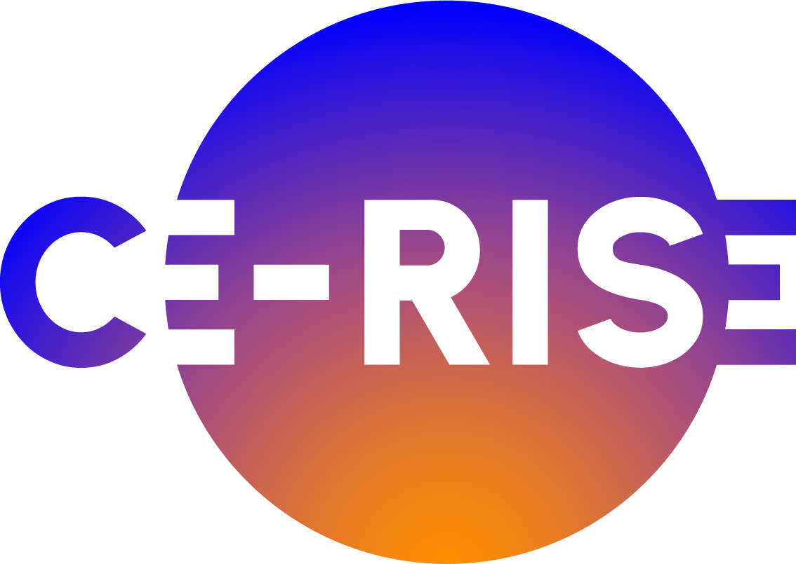

# CE-RISE SEE Impacts Calculation Service

This site documents the CE-RISE SEE impacts calculation service. SEE stands for
socio-economic and environmental impacts.

The service is the dedicated calculation layer for impact assessment in CE-RISE digital
passport workflows. It is intended to assess a product using approved background data and
return a structured, traceable life cycle assessment result.

The [CE-RISE Solution portal](https://solution.ce-rise.eu/) is the main entry point for human
users exploring the wider solution and its components.

## What the Service Does Today

The current Python implementation establishes and verifies the operational boundary:

- exposes health, capability, OpenAPI, and interactive documentation endpoints;
- opens an approved Brightway 2 background project through a read-only source-data pattern;
- reports the available Brightway databases and impact methods;
- defines the request shape that will be used for model-driven impact calculations;
- provides a small client for delegated CE-RISE model validation through `hex-core-service`.

The reserved `POST /compute` endpoint currently returns `501` after request validation. It
does not create foreground data, invoke HEX Core, or run a life cycle inventory or impact
calculation.

## Intended Calculation Flow

1. A client submits product and inventory information with explicit CE-RISE model versions.
2. The service delegates input validation to `hex-core-service`.
3. A versioned mapping resolves the validated inputs into a temporary Brightway foreground
   calculation against an approved background project.
4. The service constructs and validates an `integrated-lca` result record with calculation
   provenance.

The input and result contracts are defined by the CE-RISE
[Product System](https://codeberg.org/CE-RISE-models/product-system),
[LCI Dataset](https://codeberg.org/CE-RISE-models/lci-dataset), and
[Integrated LCA](https://codeberg.org/CE-RISE-models/integrated-lca) model repositories.

## Documentation Structure

- [Architecture](architecture.md): service boundary, calculation flow, and data handling
- [API Overview](api-overview.md): current API behavior and the reserved compute contract
- [API Reference](api-reference.md): endpoint-level request, response, and error behavior
- [Deployment](deployment.md): container image, configuration, and background provisioning
- [Local Testing](local-testing.md): probe, test, and local container workflows
- [Integration With HEX Core Service](integration.md): validation and record-management boundary
- [Project Scope](scope.md): current constraints, planned implementation, and non-goals

## Current Status

The service scaffold, Brightway compatibility probe, container image, and release workflow are
in place. The next implementation milestone is a versioned CE-RISE-to-Brightway mapping and an
end-to-end acceptance fixture; only then can `POST /compute` perform calculations.

---

---

Funded by the European Union under Grant Agreement No. 101092281 — CE-RISE.  
Views and opinions expressed are those of the author(s) only and do not necessarily reflect those of the European Union or the granting authority (HADEA).
Neither the European Union nor the granting authority can be held responsible for them.

© 2026 CE-RISE consortium.  
Licensed under the [European Union Public Licence v1.2 (EUPL-1.2)](https://joinup.ec.europa.eu/collection/eupl/eupl-text-eupl-12).  
Attribution: CE-RISE project (Grant Agreement No. 101092281) and the individual authors/partners as indicated.

Developed by NILU (Riccardo Boero — ribo@nilu.no) within the CE-RISE project.
